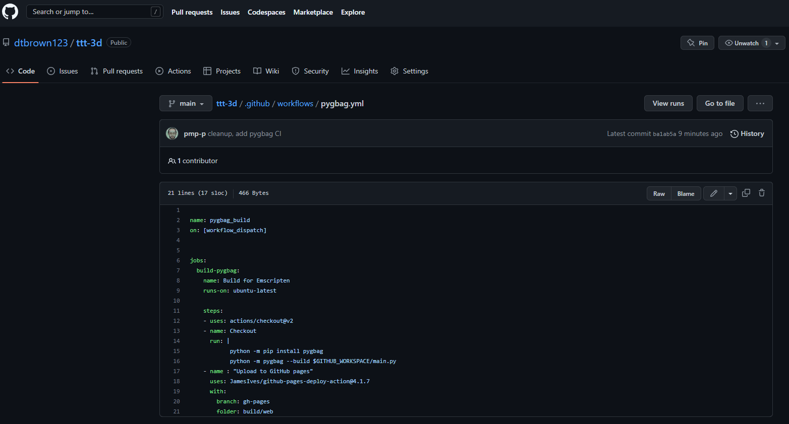
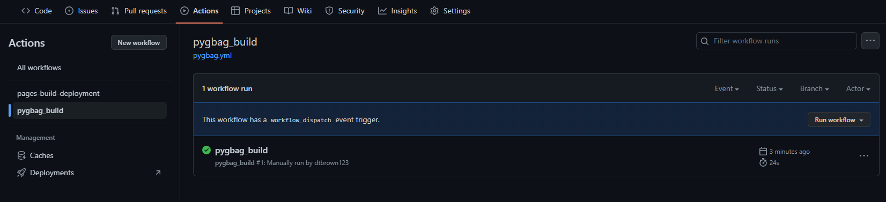
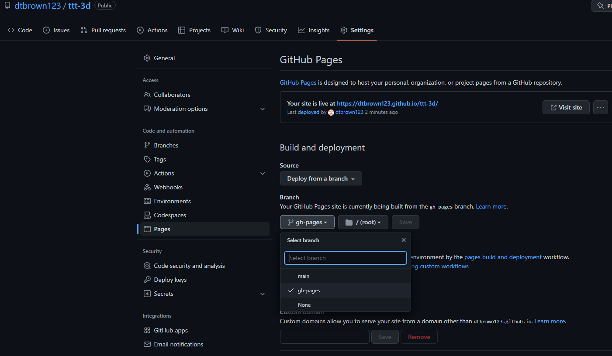

How to deploy your game on github pages

First you need this yml file:

[Download pygbag.yml](pygbag.yml)

**Note this file must be in the folder `.github/workflows/`, regardless of the repository's name**

It should look like this once in your repo :

Put it in your main branch. Once it's there, you should be able to go to the "Actions" tab in your repo and run the pygbag action.

This will create a gh-pages branch with all the build files for your game. If this step fails, go to "Settings" and under "Code and automation", click on "Actions" to double check "Workflow permissions" is properly set to "Read and write permissions" (as below):

Next, go to "Settings" and under "Code and automation", click on "Pages". Set your branch to be built from "gh-pages".

Finally, go back to "Actions" and run the "pages-build-deployment" action. Now your game will be published to username.github.io/repo-name/.

