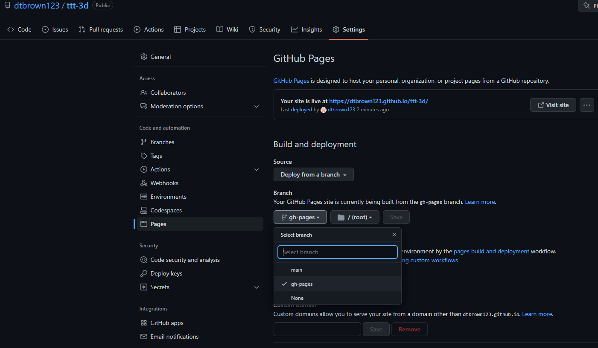

How to deploy your game on github pages

First you need this yml file:

[get a copy of text file pygbag.yml](pygbag.yml)

**Note the specific folder it is always `.github/workflows/` whatever the repo or file name is**

it should look that way once in your repo :

Put it in your main repository. Once it's there you should be able to go to the action tab in your repo and run the pygbag action.

This will create a gh-pages repository with all the build files for your game. Next, go to settings and under Code and automation, click on pages. Set your branch to be built from to gh-pages.

Finally go back to actions a run the pages-build-deployment action and your game will be published to username.github.io/repo-name/.

[contribute to this page](https://github.com/pygame-web/pygame-web.github.io/edit/main/wiki/pygbag/github.io/README.md)
